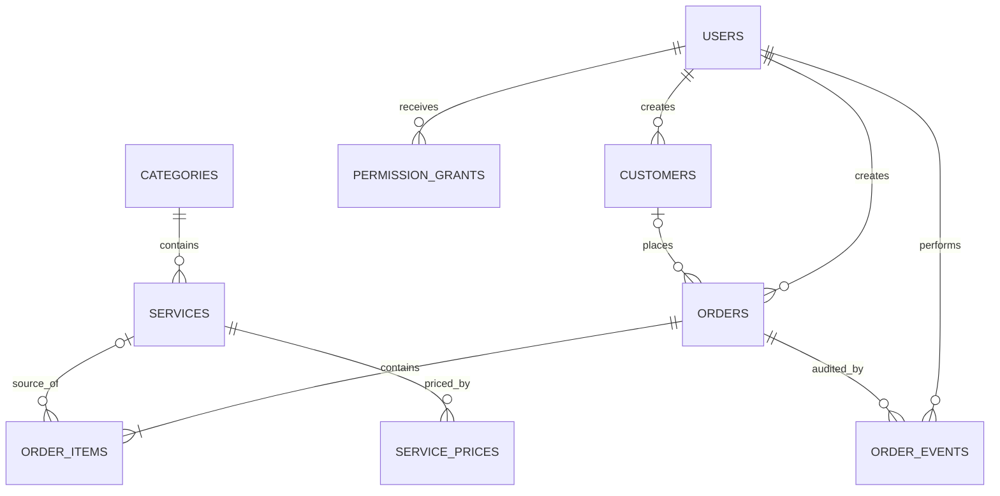

# Pearl Laundry Shop Operations

Developer implementation guide and user manual

## 1. Product scope

Pearl Laundry Shop Operations is a browser-based laundry point-of-sale and
management application. It provides:

- JWT-authenticated admin and staff accounts.
- Role-based server authorization.
- Category-colored, touch-friendly staff billing.
- Customer search, auto-fill, and durable customer records.
- Effective-dated catalog prices.
- Saudi VAT calculations and printable 80 mm tax invoices.
- Five-field VAT TLV QR payload on every draft and saved bill.
- Cash/card categorization.
- Paid, partial, and unpaid order state with advance and balance.
- Daily and historical reports.
- Server-side report pagination and lazy-loaded PDF/Excel/CSV exports.
- Validated, atomic CSV imports for customers and catalog/prices.
- Shadcn-style skeletons and client-isolated MUI progress/pagination controls.
- Typed Zustand state with session-scoped order draft persistence.
- Admin-managed historical access grants for staff.
- Admin CRUD for catalog, customers, staff users, and shop identity.
- Order payment change audit events.

The application is intentionally modular so inventory, delivery tracking,
subscriptions, loyalty, notifications, accounting exports, or multi-branch
support can be added without replacing the billing core.

## 2. Roles and permissions

| Capability | Staff | Admin |
|---|---:|---:|
| Sign in and change own password | Yes | Yes |
| Create customer while billing | Yes | Yes |
| Create orders and print invoices | Yes | Yes |
| Choose cash/card | Yes | Yes |
| Record unpaid, advance/partial, or paid | Yes | Yes |
| Read today and previous two days | Yes | Yes |
| Read older reports | Admin grant required | Yes |
| Edit today’s order payment state | Yes | Yes |
| Edit an older order | Admin grant required | Yes |
| Filter and sort reports | Allowed range only | All data |
| Manage shop identity and VAT details | No | Yes |
| Manage categories, items, and prices | No | Yes |
| Manage customers and purchase drill-down | No | Yes |
| Manage users and access grants | No | Yes |

All permissions are enforced in API handlers. Hiding admin navigation in the
browser is only a usability measure and is not relied on for security.

## 3. First-time access

The database creates two initial accounts when no users exist:

| Role | Username | Temporary password |
|---|---|---|
| Admin | `admin` | `Admin@123` |
| Staff | `staff` | `Staff@123` |

Both accounts are marked as requiring a password change. Change the passwords
immediately. The admin can then create named staff accounts and deactivate the
starter staff account if desired.

## 4. Staff workflow

### Create an order

1. Sign in with a staff or admin account.
2. Open **New order**.
3. Search for a customer by name, mobile, or email.
4. Select a result to auto-fill saved contact details.
5. If there is no match, enter the customer details manually and leave
   **Save this customer** enabled.
6. Tap service buttons. Buttons under one category share its color.
7. Adjust quantities in the order list.
8. Choose **Cash** or **Card**.
9. Enter a discount if applicable.
10. Enter the received advance:
    - `0` produces **Unpaid**.
    - An amount below the total produces **Partial**.
    - The full total produces **Paid**.
11. Choose **Save order** or **Save & print invoice**.

The server reloads every selected service and its current price from the
database. It does not trust prices, VAT, totals, status, or balance supplied by
the browser.

### Print an invoice

The print command outputs only `#invoice-receipt`. Recommended printer options:

- Paper: 80 mm thermal roll.
- Scale: 100%.
- Margins: none.
- Browser headers/footers: disabled.
- Print quality or density: high/dark.

The invoice uses a high-contrast system font, black rules, and a 30 mm QR code.

### Staff reports

Staff can read today and the two preceding calendar days. Requesting an older
range returns HTTP `403` unless the admin has issued a matching
`reports_history` grant.

Changing an order from today is allowed. Changing an older order returns HTTP
`403` unless the admin has issued an `orders_history_write` grant covering that
order date.

## 5. Admin workflow

### Dashboard

The dashboard shows today’s order count, gross sales, collected value,
outstanding balance, cash collection, card collection, recent orders, and
catalog/customer counts.

### Reports

Reports support:

- Date range.
- Paid, partial, or unpaid.
- Cash or card.
- Customer name, phone, or invoice number search.
- Total and customer sorting.
- 25-row server pagination.
- Export of up to 1,000 matching rows to PDF, Excel-compatible SpreadsheetML,
  or UTF-8 CSV.

Selecting a row opens the order lines and allows the payment method, received
amount, status, and note to be changed. Changes use optimistic version checking
and create an audit event.

### Services and prices

The data hierarchy is:

`Category → Service item → Effective-dated price`

Updating a price closes the current price record and creates a new one.
Historical order lines keep their original name, category, unit price, VAT, and
line total snapshots.

“Delete” behavior is implemented as deactivation for categories, services,
customers, and users. This preserves foreign-key integrity and historical
invoices.

### Customers

The customer screen supports create, read, update, and deactivation. Selecting
a customer loads their order history for purchase drill-down.

### Team access

The admin can:

- Create admin or staff users.
- Reset a user password.
- Activate or deactivate users.
- Grant older report read access for a date range.
- Grant older order write access for a date range.
- Revoke grants.

### Shop settings

Only an admin can change:

- English and Arabic shop names.
- Address, phone, and email.
- VAT and commercial registration numbers.
- Invoice number prefix.
- Receipt footer.

These values are read from the database and used on every invoice.

### CSV imports

Open **Import data** and download the correct template.

Customer columns:

```text
name,phone,email,address,vat_number,notes
```

Catalog columns:

```text
category_name,category_color,item_name,item_name_ar,price,sort_order
```

Rules:

- Headers are normalized for case/spacing but all required template fields must
  exist.
- Files must be UTF-8 CSV, at most 2 MB and 1,000 data rows.
- Phone values should be spreadsheet text, not numbers, so leading zeroes remain.
- Prices are positive decimal values without currency labels.
- Colors are optional `#RRGGBB` values.
- Imports are create-only. Existing customer phone/email or an existing item
  under the same category rejects the file.
- Client checks improve feedback; the API repeats validation and authorization.
- D1 batch execution makes the write atomic: no partial rows are committed.
- Export/backup current data and test a small file before a large production load.

## 6. Architecture

```text
Browser UI
  ├── Typed Zustand state + session-persisted billing draft
  ├── Shadcn-style skeletons + client-only MUI controls
  ├── JWT HttpOnly session cookie
  ├── Staff billing and printable receipt
  └── Admin management views
          │
          ▼
Vinext / Next-compatible API routes
  ├── Authentication and active-user verification
  ├── Role and date-range authorization
  ├── Server-side validation and VAT calculations
  └── Optimistic concurrency and audit events
          │
          ▼
Cloudflare D1 / local Miniflare SQLite
  ├── Users and permission grants
  ├── Shop settings
  ├── Category → Service → Price history
  ├── Customers
  └── Orders → Line snapshots → Audit events
```

### Key source locations

| Area | Location |
|---|---|
| Application shell | `app/page.tsx` |
| Staff billing | `app/components/Billing.tsx` |
| Admin views | `app/components/Admin.tsx` |
| Reports | `app/components/Reports.tsx` |
| Shared app/draft state | `app/store.ts` |
| Shadcn/MUI UI adapters | `app/components/ui/` |
| Import/export helpers | `lib/csv.ts`, `app/lib/report-export.ts` |
| Invoice math/VAT QR | `lib/invoice.ts` |
| Printable receipt | `app/components/Receipt.tsx` |
| API client/types | `app/client.ts`, `app/types.ts` |
| Authentication | `lib/auth.ts`, `lib/crypto.ts` |
| Authorization | `lib/permissions.ts` |
| Database initialization | `lib/database.ts` |
| Query layer | `lib/data.ts` |
| Relational schema | `db/schema.ts` |
| Generated migrations | `drizzle/` |
| Auth API | `app/api/auth/` |
| Orders/report API | `app/api/orders/route.ts` |
| Admin command API | `app/api/admin/route.ts` |

## 7. Database relationships



### Integrity rules

- Usernames and invoice numbers are unique.
- Foreign keys use `RESTRICT`, `CASCADE`, or `SET NULL` based on financial
  history requirements.
- Order items are immutable business snapshots.
- Prices and quantities must be positive.
- Monetary values cannot be negative.
- Payment method and status fields are constrained enumerations.
- Shop invoice sequence is advanced atomically.
- Order creation uses one D1 batch for the order, lines, optional customer, and
  audit event.
- Order updates include a version number to prevent lost updates.

## 8. Authentication and security

- Passwords use PBKDF2-SHA-256 with a random 16-byte salt and 150,000
  iterations.
- Password hashes and salts are stored; plaintext passwords are never stored.
- JWTs use HMAC-SHA-256 and expire after eight hours.
- The JWT is sent in an `HttpOnly`, `SameSite=Strict` cookie.
- HTTPS deployments also add the `Secure` cookie flag.
- Every protected request rechecks that the database user remains active and
  uses the current role.
- Production `JWT_SECRET` must contain at least 32 random bytes and remain
  outside source control.
- SQL values use D1 prepared statement bindings.
- Report sorting is allowlisted.
- Admin actions are authorized by the API route.
- Prices and financial totals are computed server-side.
- Same-origin checks protect all cookie-authenticated mutation routes.
- CSV import sizes, rows, types, duplicates, and relationships are validated
  before an atomic database batch.

Recommended follow-up hardening includes login rate limiting, account lockout,
password reset delivery, second-factor authentication, centralized security
logging, and scheduled secret rotation.

## 9. API summary

| Method and route | Purpose |
|---|---|
| `POST /api/auth/login` | Verify password and issue JWT cookie |
| `POST /api/auth/logout` | Clear JWT cookie |
| `GET /api/auth/me` | Read current active session |
| `PATCH /api/account` | Change own password |
| `GET /api/bootstrap` | Load authorized app data |
| `GET /api/orders` | Filter authorized report range |
| `GET /api/orders?id=…` | Read order, lines, and audit events |
| `POST /api/orders` | Create order/customer and invoice |
| `PATCH /api/orders` | Update payment state with authorization |
| `POST /api/admin` | Admin-only catalog/customer/user/settings commands |

## 10. Local development

Requirements: Node.js 22.13 or newer and npm.

```bash
npm install
npm run db:generate
npm run dev
```

The development script binds to `0.0.0.0`. Another device on the same Wi-Fi can
use the **Network** URL printed in the terminal. Local D1 state is stored under
the ignored `.wrangler` directory.

Validation:

```bash
npm run ci
```

CI is defined in `.github/workflows/ci.yml` and runs on pushes and pull
requests to `main` and `Dev`. Unit tests cover invoice/VAT/balance calculations,
VAT QR TLV structure, and CSV normalization/escaping. `npm audit --omit=dev`
should also be run during dependency maintenance.

## 11. Production configuration

The hosting configuration declares the logical D1 binding as `DB`.

Required secret:

```text
JWT_SECRET=<at least 32 random bytes>
```

`.env.example` documents required keys. Real environment files are ignored.
Manage the hosted secret through the deployment platform’s environment
settings.

Generated migration SQL in `drizzle/` must be committed and deployed with the
same source version.

## 12. Adding future modules

1. Add relational tables in `db/schema.ts`.
2. Generate and inspect a migration with `npm run db:generate`.
3. Keep database access in `lib/` domain helpers.
4. Add authorization checks to every sensitive read and write.
5. Preserve financial snapshots instead of joining old documents to mutable
   current values.
6. Prefer soft deletion for data referenced by invoices.
7. Add indexes for new report filters and foreign-key drill-downs.
8. Use optimistic versioning for concurrently edited records.
9. Add a module-specific view instead of enlarging the billing component.
10. Add audit events for security-sensitive or financial changes.
